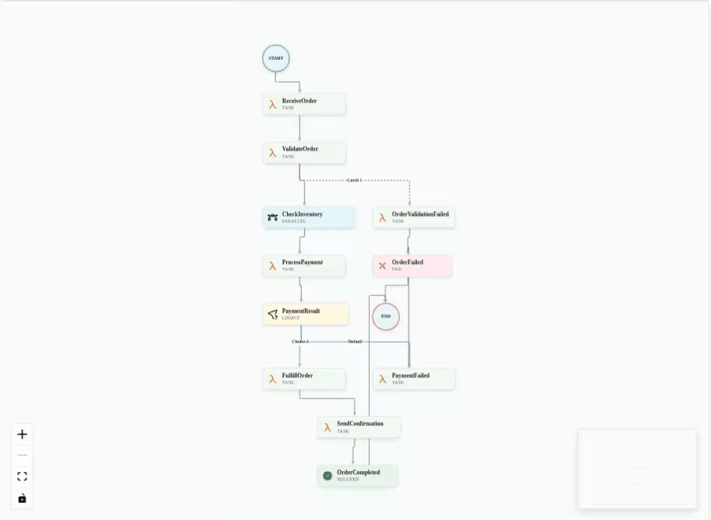

# ASL Viewer

[](https://github.com/cleissonbarbosa/asl-viewer/actions/workflows/ci.yml)
[](https://cleissonbarbosa.github.io/asl-viewer/)
[](https://badge.fury.io/js/asl-viewer)
[](https://bundlephobia.com/result?p=asl-viewer)
[](https://img.shields.io/badge/license-Apache%202.0-blue?style=flat-square)

A React library for visualizing AWS Step Functions workflows (Amazon States Language) in the browser. Built with TypeScript and based on the AWS Toolkit for VS Code.

## 📖 Live Examples

Check out our [Storybook](https://cleissonbarbosa.github.io/asl-viewer/) to see interactive examples and explore all available components and features.

<details>
<summary>GIF Example</summary>



</details>

## Features

- 🎨 **Visual Workflow Rendering** - Display ASL workflows as interactive graphs
- 🌓 **Theme Support** - Light and dark themes built-in
- 📐 **Layout Options** - Support for Top-to-Bottom and Left-to-Right layouts
- ✅ **ASL Validation** - Comprehensive validation for ASL syntax and semantics
- 🔄 **Auto Layout** - Automatic graph layout with reactive updates
- 📱 **Responsive** - Works on different screen sizes
- 🖱️ **Interactive** - Click handlers for states and connections
- 🔍 **Detailed Inspection** - Rich state details panel with JSON viewing
- 🌐 **Multiple Input Sources** - Load from definition objects, URLs, or files
- 📄 **YAML Support** - Support for both JSON and YAML formats
- 🔧 **Extensible** - Easy to customize and extend
- 📚 **TypeScript** - Full TypeScript support with comprehensive types

## Installation

```bash
npm install asl-viewer
# or
yarn add asl-viewer
```

## CSS Import

**Important:** You must import the CSS file for the component to display correctly.

### ES Modules / Webpack

```js
import "asl-viewer/dist/index.css";
```

### CommonJS

```js
require("asl-viewer/dist/index.css");
```

### HTML (if using a CDN)

```html
<link
  rel="stylesheet"
  href="https://cdn.jsdelivr.net/npm/asl-viewer@1.0.8/dist/index.css"
/>
```

### CSS-in-JS / Styled Components

If you're using CSS-in-JS libraries or have build tools that don't handle CSS imports automatically, make sure to include the CSS file in your build process or import it in your main application file.

## Quick Start

### Basic Usage with Definition Object

```tsx
import React from "react";
import { WorkflowViewer } from "asl-viewer";
import "asl-viewer/dist/index.css"; // Required CSS import

const workflow = {
  Comment: "A simple minimal example",
  StartAt: "Hello",
  States: {
    Hello: {
      Type: "Task",
      Resource: "arn:aws:lambda:us-east-1:123456789012:function:HelloWorld",
      End: true,
    },
  },
};

function App() {
  return (
    <WorkflowViewer
      definition={workflow}
      theme="light"
      width={800}
      height={600}
    />
  );
}
```

### Loading from URL

```tsx
import React from "react";
import { WorkflowViewer } from "asl-viewer";
import "asl-viewer/dist/index.css"; // Required CSS import

function App() {
  return (
    <WorkflowViewer
      url="https://example.com/workflow.json"
      theme="light"
      width={800}
      height={600}
      onLoadStart={() => console.log("Loading...")}
      onLoadEnd={() => console.log("Loaded!")}
      onLoadError={(error) => console.error("Error:", error)}
    />
  );
}
```

### Loading from File Upload

```tsx
import React, { useState } from "react";
import { WorkflowViewer, FileUploader } from "asl-viewer";
import "asl-viewer/dist/index.css"; // Required CSS import

function App() {
  const [selectedFile, setSelectedFile] = useState<File | null>(null);

  return (
    <div>
      <FileUploader
        onFileSelect={setSelectedFile}
        theme={{
          background: "white",
          borderColor: "#ddd",
          textColor: "#333",
          infoColor: "#007acc",
        }}
      />
      {selectedFile && (
        <WorkflowViewer
          file={selectedFile}
          theme="light"
          width={800}
          height={600}
        />
      )}
    </div>
  );
}
```

### YAML Support

```tsx
import React from "react";
import { WorkflowViewer } from "asl-viewer";

const yamlWorkflow = `
Comment: "A workflow in YAML format"
StartAt: "HelloWorld"
States:
  HelloWorld:
    Type: "Pass"
    Result: "Hello from YAML!"
    End: true
`;

function App() {
function App() {
  return (
    <WorkflowViewer
      definition={yamlWorkflow}
      theme="light"
      width={800}
      height={600}
    />
  );
}
```

### Interactive Mode with Draggable Nodes

```tsx
import React from "react";
import { WorkflowViewer } from "asl-viewer";

function App() {
  return (
    <WorkflowViewer
      definition={workflow}
      theme="light"
      width={900}
      height={700}
      readonly={false}
      isDraggable={true}
      isSelectable={true}
      isMultiSelect={true}
      useMiniMap={true}
      useControls={true}
      onStateClick={(state) => {
        console.log("State clicked:", state);
      }}
    />
  );
}
```

### Presentation Mode (Read-Only)

```tsx
import React from "react";
import { WorkflowViewer } from "asl-viewer";

function App() {
  return (
    <WorkflowViewer
      definition={workflow}
      theme="light"
      width={800}
      height={600}
      readonly={true}
      useControls={false}
      useMiniMap={false}
      isDraggable={false}
      isSelectable={false}
      useZoom={false}
    />
  );
}
```

### Enhanced Navigation with MiniMap

```tsx
import React from "react";
import { WorkflowViewer } from "asl-viewer";

function App() {
  return (
    <WorkflowViewer
      definition={complexWorkflow}
      theme="dark"
      width={1000}
      height={800}
      useMiniMap={true}
      useControls={true}
      useFitView={true}
      useZoom={true}
    />
  );
}
```

## Supported Formats

ASL Viewer supports multiple input formats and sources:

### Input Sources

- **Definition Object**: Pass ASL definition directly as JavaScript object
- **URL**: Load from any accessible URL (supports CORS)
- **File Upload**: Upload local JSON or YAML files via file picker or drag & drop

### File Formats

- **JSON**: Standard ASL format as used by AWS Step Functions
- **YAML**: Human-readable YAML format with same structure as JSON

### Content Types

The library automatically detects format based on:

- File extension (`.json`, `.yaml`, `.yml`)
- MIME type (`application/json`, `application/yaml`, `text/yaml`)
- Content analysis (fallback parsing)

### Example Files

```bash
# JSON format
{
  "Comment": "A simple workflow",
  "StartAt": "FirstState",
  "States": {
    "FirstState": {
      "Type": "Pass",
      "End": true
    }
  }
}

# YAML format
Comment: "A simple workflow"
StartAt: "FirstState"
States:
  FirstState:
    Type: "Pass"
    End: true
```

## API Reference

### WorkflowViewer Props

| Prop                | Type                               | Default   | Description                                 |
| ------------------- | ---------------------------------- | --------- | ------------------------------------------- |
| `definition`        | `ASLDefinition \| string`          | -         | The ASL workflow definition (JSON or YAML)  |
| `url`               | `string`                           | -         | URL to load the ASL definition from         |
| `file`              | `File`                             | -         | File object containing the ASL definition   |
| `theme`             | `'light' \| 'dark'`                | `'light'` | Visual theme                                |
| `layoutDirection`   | `'TB' \| 'LR'`                     | `'TB'`    | Layout direction (Top-Bottom or Left-Right) |
| `width`             | `number`                           | `800`     | Viewer width in pixels                      |
| `height`            | `number`                           | `600`     | Viewer height in pixels                     |
| `readonly`          | `boolean`                          | `true`    | Whether the viewer is read-only             |
| `isConnectable`     | `boolean`                          | `true`    | Whether nodes can be connected              |
| `isDraggable`       | `boolean`                          | `false`   | Whether nodes can be dragged                |
| `isSelectable`      | `boolean`                          | `true`    | Whether nodes can be selected               |
| `isMultiSelect`     | `boolean`                          | `false`   | Whether multiple nodes can be selected      |
| `useMiniMap`        | `boolean`                          | `false`   | Whether to show navigation minimap          |
| `useControls`       | `boolean`                          | `true`    | Whether to show zoom/pan controls           |
| `useZoom`           | `boolean`                          | `true`    | Whether zooming is enabled                  |
| `useFitView`        | `boolean`                          | `true`    | Whether to auto-fit view to show all nodes  |
| `showToolbar`       | `boolean`                          | `false`   | Whether to show the toolbar                 |
| `hideComment`       | `boolean`                          | `false`   | Whether to hide the workflow comment        |
| `onStateClick`      | `(state: StateNode) => void`       | -         | Callback when a state is clicked            |
| `onValidationError` | `(error: ValidationError) => void` | -         | Callback for validation errors              |
| `onLoadStart`       | `() => void`                       | -         | Callback when loading starts                |
| `onLoadEnd`         | `() => void`                       | -         | Callback when loading completes             |
| `onLoadError`       | `(error: Error) => void`           | -         | Callback when loading fails                 |
| `className`         | `string`                           | -         | Additional CSS class names                  |
| `style`             | `React.CSSProperties`              | -         | Inline styles for the root container        |

**Note:** You must provide exactly one of `definition`, `url`, or `file`.

## Usage Modes

### Interactive Mode

Enable full interactivity with draggable nodes, multi-selection, and comprehensive controls:

```tsx
<WorkflowViewer
  definition={workflow}
  readonly={false}
  isDraggable={true}
  isSelectable={true}
  isMultiSelect={true}
  useMiniMap={true}
  useControls={true}
  onStateClick={(state) => console.log("Clicked:", state)}
/>
```

### Presentation Mode

Perfect for presentations or documentation with minimal UI:

```tsx
<WorkflowViewer
  definition={workflow}
  readonly={true}
  useControls={false}
  useMiniMap={false}
  isDraggable={false}
  isSelectable={false}
  useZoom={false}
/>
```

### Navigation Mode

Ideal for complex workflows with enhanced navigation features:

```tsx
<WorkflowViewer
  definition={largeWorkflow}
  useMiniMap={true}
  useControls={true}
  useFitView={true}
  useZoom={true}
  width={1000}
  height={800}
/>
```

### Horizontal Layout

Display the workflow from left to right instead of top to bottom:

```tsx
<WorkflowViewer
  definition={workflow}
  layoutDirection="LR"
  width={1000}
  height={600}
/>
```

### Embedded Mode

Compact view for embedding in dashboards or smaller spaces:

```tsx
<WorkflowViewer
  definition={simpleWorkflow}
  width={400}
  height={300}
  useControls={false}
  useMiniMap={false}
  useFitView={true}
/>
```

### FileUploader Props

| Prop           | Type                   | Default              | Description                      |
| -------------- | ---------------------- | -------------------- | -------------------------------- |
| `onFileSelect` | `(file: File) => void` | **required**         | Callback when a file is selected |
| `theme`        | `ViewerTheme`          | **required**         | Theme object for styling         |
| `accept`       | `string`               | `".json,.yaml,.yml"` | File types to accept             |
| `disabled`     | `boolean`              | `false`              | Whether the uploader is disabled |
| `className`    | `string`               | -                    | Additional CSS class names       |
| `style`        | `React.CSSProperties`  | -                    | Inline styles                    |

### URLInput Props

| Prop          | Type                    | Default                            | Description                    |
| ------------- | ----------------------- | ---------------------------------- | ------------------------------ |
| `onUrlSubmit` | `(url: string) => void` | **required**                       | Callback when URL is submitted |
| `theme`       | `ViewerTheme`           | **required**                       | Theme object for styling       |
| `disabled`    | `boolean`               | `false`                            | Whether the input is disabled  |
| `placeholder` | `string`                | `"Enter URL to ASL definition..."` | Placeholder text               |
| `className`   | `string`                | -                                  | Additional CSS class names     |
| `style`       | `React.CSSProperties`   | -                                  | Inline styles                  |

### Types

```tsx
import type {
  ASLDefinition,
  StateDefinition,
  StateType,
  ValidationError,
  WorkflowViewerProps,
  ViewerTheme,
  StateNode,
} from "asl-viewer";
```

### Utilities

```tsx
import {
  validateASLDefinition,
  parseASLDefinition,
  createGraphLayout,
  loadFromURL,
  loadFromFile,
  parseDefinitionString,
} from "asl-viewer";

// Validate an ASL definition
const errors = validateASLDefinition(workflow);

// Load from URL
const workflowFromUrl = await loadFromURL("https://example.com/workflow.json");

// Load from file
const workflowFromFile = await loadFromFile(file);

// Parse string (JSON or YAML)
const workflowFromString = parseDefinitionString(yamlOrJsonString);

// Parse and get structured data
const parsed = parseASLDefinition(workflow);

// Create custom layout
const layout = createGraphLayout(parsed.nodes, parsed.connections);
```

## Supported ASL Features

- ✅ **Task States** - Lambda functions, activities, and other tasks
- ✅ **Choice States** - Conditional branching with choice rules
- ✅ **Pass States** - Data transformation and flow control
- ✅ **Wait States** - Delays and timeouts
- ✅ **Succeed/Fail States** - Terminal states
- ✅ **Parallel States** - Concurrent execution branches
- ✅ **Map States** - Iteration over arrays (basic support)
- ✅ **Retry/Catch** - Error handling configuration
- ✅ **Input/Output Processing** - Path expressions and filters

## Feature Configuration

### Interactive Features

Control user interactions with the workflow:

```tsx
// Enable all interactive features
<WorkflowViewer
  definition={workflow}
  readonly={false}
  isDraggable={true}        // Drag nodes around
  isSelectable={true}       // Click to select nodes
  isMultiSelect={true}      // Select multiple nodes
  isConnectable={true}      // Connect nodes (if applicable)
/>

// Read-only with selection only
<WorkflowViewer
  definition={workflow}
  readonly={true}
  isSelectable={true}
  isDraggable={false}
  isMultiSelect={false}
/>
```

### Navigation Controls

Configure zoom, pan, and navigation features:

```tsx
// Full navigation controls
<WorkflowViewer
  definition={workflow}
  useControls={true}        // Show zoom/pan buttons
  useZoom={true}           // Enable zoom functionality
  useFitView={true}        // Auto-fit content to view
  useMiniMap={true}        // Show minimap for navigation
/>

// Minimal navigation
<WorkflowViewer
  definition={workflow}
  useControls={false}
  useZoom={false}
  useFitView={true}
  useMiniMap={false}
/>
```

### Event Handling

Handle user interactions and loading events:

```tsx
<WorkflowViewer
  definition={workflow}
  onStateClick={(state) => {
    console.log("State clicked:", state.name, state.type);
    // Handle state selection, show details, etc.
  }}
  onValidationError={(error) => {
    console.error("Validation error:", error.message);
    // Handle validation errors
  }}
  onLoadStart={() => {
    console.log("Loading workflow...");
    // Show loading indicator
  }}
  onLoadEnd={() => {
    console.log("Workflow loaded successfully");
    // Hide loading indicator
  }}
  onLoadError={(error) => {
    console.error("Failed to load workflow:", error);
    // Show error message
  }}
/>
```

## Examples

Check out the `/examples` directory for complete usage examples:

- [Simple React App](./examples/react-app-example.tsx)
- [Complex Workflows](./examples/complex-workflow.json)
- [Parallel Execution](./examples/parallel-workflow.json)

## Development

### Setup

```bash
git clone <repository>
cd asl-viewer
yarn install
```

### Build

```bash
yarn build
```

### Storybook

Run Storybook locally for development:

```bash
yarn storybook
```

Build Storybook for production:

```bash
yarn build-storybook
```

The Storybook is automatically deployed to GitHub Pages at [https://cleissonb.github.io/asl-viewer/](https://cleissonb.github.io/asl-viewer/) when changes are pushed to the main branch.

### Testing

```bash
yarn test
```

## Customization

### Custom Themes

#### Example 1:

```tsx
import { WorkflowViewer, getTheme } from "asl-viewer";
import "asl-viewer/dist/index.css"; // Don't forget the CSS import

const customTheme = {
  ...getTheme("light"),
  nodeColors: {
    ...getTheme("light").nodeColors,
    taskState: "#ff6b6b",
    choiceState: "#4ecdc4",
  },
};

<WorkflowViewer definition={workflow} theme={customTheme} />;
```

#### Example 2:

```tsx
import { WorkflowViewer, createCustomTheme } from "asl-viewer";
import "asl-viewer/dist/index.css"; // Don't forget the CSS import

const customPurple = createCustomTheme("dark", {
  name: "customPurple",
  background: "#1a0033",
  surfaceColor: "#2d1b69",
  nodeColors: {
    task: "#4c1d95",
    choice: "#7c2d12",
    succeed: "#065f46",
  },
  nodeBorderColors: {
    task: "#8b5cf6",
    choice: "#f59e0b",
    succeed: "#10b981",
  },
  textColor: "#e879f9",
  connectionColor: "#c084fc",
  tooltipBackground: "#3c004d",
  tooltipTextColor: "#f0f0f0",
});

<WorkflowViewer definition={workflow} theme={customPurple} />;
```

## Contributing

1. Fork the repository
2. Create a feature branch: `git checkout -b feature-name`
3. Make your changes
4. Add tests for new functionality
5. Run the test suite: `yarn test`
6. Submit a pull request

## License

This project is licensed under the Apache License 2.0 - see the [LICENSE](LICENSE) file for details.
